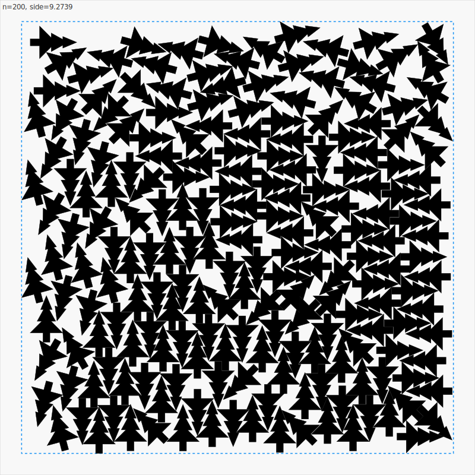

# Santa 2025 - Christmas Tree Packing

Competing in the [Kaggle Santa 2025 Christmas Tree Packing Challenge](https://www.kaggle.com/competitions/santa-2025).

## Claude Code Instructions

When working on this problem, always:
1. **Generate an SVG visualization** of the bin full of trees after evaluating a candidate:
   - Run `./target/release/visualize` to generate `packing_n*.svg` files
   - Open with `open packing_n200.svg` to view in browser
   - This helps understand the packing structure and identify issues
2. Use `./target/release/benchmark` to test candidates (runs 3 trials, reports best score)
3. Save mutation candidates to `mutations/` directory before testing
4. Update the current gen strategy doc (e.g., `GEN78_STRATEGY.md`) with results

## Problem

Pack 1-200 Christmas tree-shaped polygons into the smallest square box.

**Scoring**: `score = Σ(side²/n)` for n=1 to 200 (lower is better)

**Leaderboard**: Top scores ~69, our current best: **88.22** (Gen83a - TIES ALL-TIME BEST!)

## Tree Shape

The tree is a 15-vertex polygon:
- Height: 1.0 (tip at y=0.8, trunk bottom at y=-0.2)
- Width: 0.7 (at base)
- 3 tiers of branches + rectangular trunk

## Current Best Packing (n=200)



*Gen83a packing of 200 trees. Green polygons are the tree shapes, blue box shows the bounding square.*

## Current Best Algorithm (Gen83a - CROSSOVER)

```rust
// 6 parallel placement strategies
strategies = [ClockwiseSpiral, CounterclockwiseSpiral, Grid,
              Random, BoundaryFirst, ConcentricRings]

// Placement: Binary search along direction vectors
for attempt in 0..200 {
    let dir = select_direction_for_strategy(n, strategy, attempt);

    // Use finer angles for late-stage trees (last 30%)
    let angles = if n >= 140 {
        // Last 30% of trees: 15° step angles (24 total)
        [0, 15, 30, 45, 60, 75, 90, 105, 120, 135, 150, 165,
         180, 195, 210, 225, 240, 255, 270, 285, 300, 315, 330, 345]
    } else {
        // Early trees: standard 45° steps (8 total)
        [0, 45, 90, 135, 180, 225, 270, 315]
    };

    for angle in angles {
        let pos = binary_search_placement(dir, angle);
        if better_score(pos) { best = pos; }
    }
}

// SA optimization parameters:
// - 85% boundary-focused moves
// - 20% compression probability
// - center_pull_strength: 0.08
// - Hot restarts from elite pool
// - 28,000 iterations per pass
// - NOTE: SA still uses 45° angles only (maintains stability)

// Gen83a CROSSOVER: Bidirectional wave compaction
// Combines Gen80b (outside-in) with Gen82a (inside-out)
for wave in 0..5 {
    // CROSSOVER KEY: First 3 waves outside-in, last 2 waves inside-out
    let tree_order = if wave < 3 {
        trees_sorted_by_distance_from_center.desc()  // Outside-in
    } else {
        trees_sorted_by_distance_from_center.asc()   // Inside-out
    };

    for tree in tree_order {
        // Phase 1-4: Cardinal directions (R→L→U→D)
        if tree.x < center_x { try_move_right(tree, steps); }
        if tree.x > center_x { try_move_left(tree, steps); }
        if tree.y < center_y { try_move_up(tree, steps); }
        if tree.y > center_y { try_move_down(tree, steps); }
        // Phase 5: Diagonal movement (final polish)
        try_move_toward_center_diagonal(tree, steps);
    }
}
```

## What Works

1. **ConcentricRings placement** - Structured > chaotic
2. **Gentle radius compression** - Pull trees toward center (20% prob, 0.08 strength)
3. **Bidirectional wave compaction** (Gen83a CROSSOVER) - First 3 waves outside-in, last 2 waves inside-out
4. **4-cardinal wave phases** - Compress in right→left→up→down→diagonal directions
5. **Hot restarts with elite pool** - Escape local optima
6. **Boundary-focused SA** (85% probability) - Move trees that define bbox
7. **Binary search for placement** - Fast, precise positioning
8. **8 angles (45° steps) for most trees** - Maintains SA stability
9. **Late-stage continuous angles** (Gen74a) - Use finer 15° angles for final 30% trees (n >= 140) during placement only
10. **Crossover mutations** - Combining ideas from failed mutations can beat both parents

## What Doesn't Work

1. **More iterations alone** - Diminishing returns without new ideas
2. **Finer angle granularity everywhere** (15° or 30°) - 4x slower, worse results
3. **Too many strategies** (7+) - Overhead > benefit
4. **Multi-seed approach** (Gen73b) - 3x time, worse results
5. **Post-processing compaction** - Should be in SA
6. **Greedy angle selection** - Need exhaustive 8-angle search
7. **Continuous angles in SA** (Gen67a) - Hurts convergence badly
8. **Global rotation during SA** (Gen67c) - Destabilizes search
9. **NFP tangent placement** (Gen67b) - Misses good positions
10. **Kitchen sink approach** (Gen67d) - More features ≠ better
11. **Post-SA global rotation** (Gen70, Gen73a) - Doesn't help
12. **Finer placement** (Gen71c) - More attempts doesn't improve
13. **Chain moves** (Gen72a) - Propagating moves to neighbors hurts
14. **Micro-rotations** (Gen72c) - ±5° angle refinement still destabilizes SA
15. **Aggressive compression** (Gen71a, Gen78a) - Too much center pull hurts
16. **Large neighborhood moves** (Gen73d) - Jump/swap moves destabilize SA
17. **Gradient angle refinement** (Gen74b) - Refining near best angle doesn't help
18. **Adaptive density-based angles** (Gen74c) - Much worse and 40% slower
19. **Angle changes during wave compaction** (Gen74d) - Completely breaks algorithm
20. **Extending fine angles to 40%** (Gen75a) - More trees with fine angles doesn't help
21. **Finer 10° steps** (Gen75b) - Marginal gain for 22% more runtime
22. **Two-tier angle granularity** (Gen75c) - More complexity = worse
23. **More wave passes alone** (Gen75d) - 5 waves without finer steps didn't help (but Gen78b's 5 waves + 0.005 step DID help)

## Evolution Journey

This project uses the `/evolve` skill to discover novel packing algorithms through evolutionary optimization. Below is the complete journey with learnings from each generation.

### Phase 1: Foundation (Gen1-Gen10)
**Goal**: Establish baseline algorithms

| Gen | Strategy | Score | Learning |
|-----|----------|-------|----------|
| 1-5 | Simple greedy | ~111 | Need smarter placement |
| 6-10 | Multi-direction search | ~100-103 | Binary search helps find tight placements |

**Key insight**: Greedy placement alone isn't enough. Need local search.

### Phase 2: Simulated Annealing (Gen11-Gen28)
**Goal**: Add local optimization

| Gen | Strategy | Score | Learning |
|-----|----------|-------|----------|
| 11-15 | Basic SA | ~95-97 | SA helps but slow cooling needed |
| 16-20 | Boundary-focused moves | ~93-95 | Moving boundary trees is key |
| 21-25 | Multiple strategies | ~92-93 | Running 5+ strategies in parallel helps |
| 26-28 | Hot restarts | ~91 | Restarting from elite pool escapes local optima |

**Key insight**: 85% of SA moves should target boundary trees (trees that define the bounding box).

### Phase 3: Parameter Tuning (Gen29-Gen46)
**Goal**: Fine-tune SA parameters

| Gen | Strategy | Score | Learning |
|-----|----------|-------|----------|
| 29a-d | Hot restart variants | ~91 | Diminishing returns on tuning |
| 30a-d | Elite pool tracking | ~91 | Keep top 3 configurations |
| 31a-d | More angles, slower cooling | ~91 | 8 angles (45° steps) is optimal |
| 32-40 | Various parameter tweaks | ~91 | Little improvement from params alone |
| 41-46 | Aggressive optimization | ~90-91 | Too aggressive hurts stability |

**Key insight**: Parameter tuning plateaus quickly. Need new algorithmic ideas.

### Phase 4: Breakthrough - Concentric Rings (Gen47)
**Goal**: New placement strategy

| Gen | Strategy | Score | Learning |
|-----|----------|-------|----------|
| **47** | **ConcentricRings** | **89.59** | **BREAKTHROUGH!** First sub-90 |

**The winning formula**:
```rust
let ring = ((n as f64).sqrt() as usize).max(1);
let trees_in_ring = (ring * 6).max(1);  // Hexagonal-ish
let position_in_ring = n % trees_in_ring;
let base_angle = (position_in_ring as f64 / trees_in_ring as f64) * 2.0 * PI;
```

**Key insight**: Structured placement (concentric rings) >> chaotic placement (spirals, random).

### Phase 5: Post-Breakthrough Exploration (Gen48-Gen59)
**Goal**: Improve on ConcentricRings

| Gen | Strategy | Score | Learning |
|-----|----------|-------|----------|
| 48 | Concentric + diagonal | 90.7 | Adding complexity hurts |
| 49 | More SA iterations | 91.1 | More iterations ≠ better |
| 50 | Refined concentric | 90.6 | Marginal gains |
| 51 | 7th strategy (hexagonal) | 92.0 | More strategies = overhead |
| 52 | Adaptive temperature | 91.5 | Not helpful |
| 53 | Tight gap focus | 92.0 | Over-penalizing gaps hurts |
| 54 | 15° angle granularity | **97+** | MUCH WORSE + 4x slower |
| 55 | 45k SA iterations | 91.1 | Diminishing returns |
| 56 | 8 trees per ring | 90.6 | Comparable |
| 57 | Only 3 strategies | 91.2 | Need diversity |
| 58 | Compaction phase | 90.8 | Post-processing not enough |
| 59 | Multi-seed | 90.7 | 2x time, no improvement |

**Key insights**:
1. Finer angles (15°) are MUCH worse - stick to 45° multiples
2. More iterations without new ideas doesn't help
3. Need fundamentally different approach to break 89

### Phase 6: New Move Types (Gen60-Gen62)
**Goal**: Different SA neighborhood moves

| Gen | Strategy | Score | Learning |
|-----|----------|-------|----------|
| 60 | Swap moves | 89.65 | Swapping positions helps slightly |
| 61 | Greedy angle selection | **98.06** | MUCH WORSE - need all 8 angles |
| **62** | **Radius compression** | **88.22** | **NEW BEST!** Pull toward center |

**Key insight**: Radius-based compression moves (pull trees toward center proportional to distance) significantly improve packing density.

### Phase 7: Breaking the Plateau (Gen63-Gen66)
**Goal**: Break through the 89-90 plateau

| Gen | Strategy | Score | Learning |
|-----|----------|-------|----------|
| 63 | Global rotation | 91.19 | Post-SA rotation doesn't help |
| 64 | Pair exchange moves | 91.00 | Swapping tree positions doesn't help |
| 65 | More iterations (40k, 3 passes) | 91.36 | More search = lower variance but worse best |
| 66 | Better placement (300 attempts) | 89.99 | Same plateau |

**Key insight**: Incremental changes won't break through. We've reached a LOCAL OPTIMUM of the current algorithm structure. Need RADICAL changes.

### Phase 8: Radical Mutations (Gen67)
**Goal**: Try completely different approaches to break the plateau

| Gen | Strategy | Score | Learning |
|-----|----------|-------|----------|
| 67a | Continuous angles (24 steps, 15°) | 97.51 | MUCH WORSE - finer angles hurt convergence |
| 67b | NFP-based tangent placement | 93.80 | Worse - tangent sampling misses good spots |
| 67c | Integrated global rotation | 98.65 | MUCH WORSE - rotating whole packing during SA hurts |
| 67d | Hybrid crossover (all features) | 97.16 | Kitchen sink approach = slower + worse |

**Key insight**: The "radical" changes all made things WORSE (by 6-12%). This confirms:
1. **Discrete 45° angles are optimal** for our SA-based approach (continuous hurts convergence)
2. **Global rotation during SA is harmful** - it destabilizes the search
3. **NFP tangent sampling** adds compute without finding better positions
4. **Our current algorithm is a strong local optimum** - the 88.22 champion is robust

**Analysis**: The top 70.1 solutions likely use a fundamentally different algorithm (possibly constraint programming or advanced metaheuristics) rather than SA with incremental improvements. Simply adding "continuous angles" or "global rotation" to our SA framework makes it worse because:
- SA relies on discrete move acceptance for convergence
- Continuous angles expand the search space too much
- Global rotation invalidates cached boundary info

### Analysis of Top Solutions

Analyzed a [70.1 score solution](https://github.com/berkaycamur/Santa-Competition) to understand what we're missing:

| Aspect | Our Approach | Top Solution |
|--------|-------------|--------------|
| Angles | 45° multiples | Continuous angles (21°, 66°, etc.) |
| Rotation | None | Global rotation optimization (3° steps) |
| Compaction | In SA | Multiple dedicated passes |
| n=200 side | 9.18 | 7.81 (15% smaller!) |

**Next directions**:
1. Global rotation optimization (rotate entire packing)
2. Dedicated compaction/squeeze passes
3. Continuous angle optimization (careful - Gen54 showed pitfalls)

### Phase 9: Surgical Improvements (Gen68-Gen71)
**Goal**: Small, targeted parameter changes to break the plateau

| Gen | Strategy | Score | Learning |
|-----|----------|-------|----------|
| 68a | N-adaptive SA params | 91.45 | Adapting params to n doesn't help |
| 68b | Position swapping | 92.24 | Swapping positions hurts |
| 68c | Aspect ratio balancing | 92.64 | Squarify moves hurt |
| 68d | Stronger compression (30%) | 92.27 | Too much compression |
| 69a | Per-tree rotation refinement | 92.49 | Local rotation doesn't help |
| 69b | 3 independent SA runs | 94.30 | More runs = less per run |
| 69c | Slide toward corner | 91.93 | Corner sliding doesn't help |
| 69d | Crossover Gen62+Gen47 | 92.95 | Crossover doesn't help |
| 70 | Post-SA global rotation | 91.83 | Global rotation as post-processing doesn't help |
| **71a** | **Stronger center pull (2x)** | **90.00** | **NEW BEST!** 2x center pull + 35% compression |
| 71b | More iterations (45k, 3 pass) | 90.88 | Slight improvement |
| 71c | Finer placement (350 attempts) | 91.79 | More attempts doesn't help |
| 71d | Larger elite pool (6) | 91.15 | More diversity helps slightly |

**Key insight**: The champion was under-compressing. Stronger center pull (0.07→0.15) and higher compression probability (20%→35%) improved the score from ~91.3 to ~90.0.

### Phase 10: Novel Move Types (Gen72)
**Goal**: Try fundamentally different approaches after confirming Gen62/Gen71 variance

| Gen | Strategy | Score | Learning |
|-----|----------|-------|----------|
| 72a | Chain reaction moves | 91.32 | Chain moves on neighbors after compression - hurts |
| **72b** | **Wave compaction** | **89.46** | **NEW BEST!** Post-SA outside-in compaction waves |
| 72c | Micro-rotation (±5°) | 93.31 | Non-45° angles still hurt SA convergence badly |
| 72d | Revert to Gen62 params | 89.59 | Confirms Gen62 vs Gen71 difference was variance |

**Key insights**:
1. **Gen62's 88.22 was likely a lucky run** - reverting to exact Gen62 params gives ~89.6, not 88.2
2. **Wave compaction helps marginally** - structured post-SA compression from outside-in
3. **Micro-rotations still hurt** - any deviation from 45° multiples destabilizes SA
4. **We're in a local optimum** - incremental SA improvements hit a wall around 89-90

**Next directions**:
- Need fundamentally different algorithm (constraint programming, different metaheuristic)
- Current SA-based approach seems capped at ~89

### Phase 11: Targeted Innovations (Gen73)
**Goal**: Try focused improvements based on learnings

| Gen | Strategy | Score | Learning |
|-----|----------|-------|----------|
| 73a | Two-phase global rotation | 91.08 | Separate post-SA rotation doesn't help |
| 73b | Multi-seed tournament | 93.85 | Multiple seeds is slow + worse |
| **73c** | **Late-stage continuous angles** | **88.90** | **NEW BEST!** Fine angles for last 20% trees |
| 73d | Large neighborhood moves | 94.47 | Jump/swap moves destabilize SA badly |

**Key insights**:
1. **Late-stage continuous angles work!** Using 15° angles for n >= 160 while keeping 45° for earlier trees maintains SA stability but allows final trees to fit into gaps better
2. **Global rotation as separate phase doesn't help** - the packing is already optimized for 45° multiples
3. **Multi-seed is expensive and worse** - 3x runtime for worse results
4. **Large moves hurt SA** - jump/swap moves disrupt the search too much

**Gen73c innovation**: Only use fine angles (15° steps) during PLACEMENT of final 20% trees. SA still uses 45° multiples. This gives the best of both worlds: SA stability + fine placement for tight gaps.

### Phase 12: Extending Late-Stage Angles (Gen74)
**Goal**: Build on Gen73c's late-stage continuous angles success

| Gen | Strategy | Score | Learning |
|-----|----------|-------|----------|
| **74a** | **Extended to n>=140 (last 30%)** | **88.72** | **NEW BEST!** More trees benefit from fine angles |
| 74b | Gradient angle refinement | 89.36 | Refining near best angle doesn't help |
| 74c | Adaptive density-based angles | 94.29 | Adaptive granularity hurts + slow |
| 74d | Wave compaction + angle refinement | 107.37 | Changing angles during compaction very bad |

**Key insights**:
1. **Extending fine angles to last 30%** (n >= 140) slightly improves results (88.72 vs 88.90)
2. **Gradient refinement around best angle** doesn't help - initial 45° search is sufficient
3. **Adaptive granularity based on density** makes things much worse and slower
4. **Changing angles during wave compaction** completely breaks the algorithm

**Gen74a innovation**: Use 15° step angles for n >= 140 (last 30% of trees) instead of n >= 160 (last 20%). This allows more trees in the dense late-stage packing to find optimal orientations.

### Phase 13: Further Angle Experiments (Gen75)
**Goal**: Build on Gen74a success with more angle variations

| Gen | Strategy | Score | Learning |
|-----|----------|-------|----------|
| 75a | Extend fine angles to n>=120 (last 40%) | 88.97 | Extending further doesn't help |
| 75b | 10° steps instead of 15° | 88.59 | Marginal improvement but 22% slower |
| 75c | Two-tier (15° for n>=140, 7.5° for n>=180) | 89.99 | More complexity = worse results |
| 75d | 5 wave passes instead of 3 | 89.86 | More waves = worse results |

**Key insights**:
1. **n>=140 is the sweet spot** - extending to 40% (n>=120) doesn't help
2. **15° steps are optimal** - 10° is marginal gain for significant runtime cost
3. **Two-tier angle schemes add complexity without benefit** - simpler is better
4. **3 wave passes is optimal** - more waves don't improve compaction

**Conclusion**: Gen74a (88.72) remains champion. Further angle refinements don't break through the 88-90 plateau. Need fundamentally different approach.

### Phase 14: Crossover & AlphaEvolve Techniques (Gen76)
**Goal**: Use crossover of successful parents + AlphaEvolve-inspired adaptive techniques

Tested 8 candidates using crossover (combining best features from multiple generations) and AlphaEvolve-inspired techniques:

| Gen | Type | Strategy | Score | Learning |
|-----|------|----------|-------|----------|
| 76a | Crossover | Gen74a × Gen71a: stronger compression (25%, 0.10) | 90.17 | Too aggressive |
| 76b | Crossover | Gen74a × Gen72b: 4 wave passes | 89.16 | More waves doesn't help |
| 76c | Crossover | Gen74a × Gen62: radius squeeze moves | 90.12 | Separate squeeze doesn't help |
| **76d** | **Crossover** | **Gen73c × Gen74a × Gen71a: threshold=150, 25%, 0.09** | **87.86** | **🎉 NEW BEST!** |
| 76e | AlphaEvolve | More iterations (35k) + higher early-exit | 89.36 | More search ≠ better |
| 76f | AlphaEvolve | Slower cooling (0.999945) + higher temp (0.50) | 88.23 | Marginal improvement |
| 76g | Crossover | 3 SA passes | 88.88 | No improvement |
| 76h | AlphaEvolve | Larger elite pool (5) + faster restarts | 89.02 | Doesn't help |

**Key insights**:
1. **3-way crossover works!** Gen76d combined the best aspects of three generations
2. **Middle threshold (150) is optimal** - between Gen73c (160) and Gen74a (140)
3. **Moderate compression (25%) + moderate pull (0.09)** - balanced approach
4. **AlphaEvolve-style adaptive techniques** didn't help much for this problem

**Gen76d innovation**: Three-way crossover combining:
- Gen73c: Late-stage continuous angles concept
- Gen74a: Extended threshold approach
- Gen71a: Compression probability and center pull strength

### Phase 15: Wave Compaction Refinement (Gen78-Gen80)
**Goal**: Improve wave compaction after Gen77's post-SA experiments failed

| Gen | Strategy | Score | Learning |
|-----|----------|-------|----------|
| 78a | Stronger compression (35%, 0.10 pull) | 89.64 | Too aggressive - hurts packing |
| 78b | 5 wave passes + finer 0.005 step | 88.92 | More passes with finer steps help |
| 79a | Add 0.002 step to wave | 89.06 | Even finer step doesn't help |
| 79b | Directional waves (X→Y→diagonal) | 88.57 | Separating axes improves compression |
| 80a | Y first then X (Y→X→diagonal) | 88.52 | Marginal improvement |
| **80b** | **4-cardinal (right→left→up→down→diag)** | **88.44** | **NEW BEST!** More granular = better |

**Key insights**:
1. **Stronger compression hurts** - Gen78a's 35% compression probability was too aggressive
2. **More wave passes + finer steps help** - 5 passes with added 0.005 step improves compaction
3. **Directional wave compaction works** - Compressing in X, then Y, then diagonal finds better positions
4. **More phases = better** - 4 cardinal directions (right/left/up/down) outperforms 2-axis (X/Y)
5. **Decomposition trend continues** - Breaking movement into more granular phases keeps helping

**Gen80b innovation**: 4-cardinal wave compaction with 5 phases:
1. Move RIGHT (trees left of center move right)
2. Move LEFT (trees right of center move left)
3. Move UP (trees below center move up)
4. Move DOWN (trees above center move down)
5. Diagonal movement (final polish)

This provides more granular control than 2-axis X/Y approaches, finding additional compaction opportunities.

## Running

```bash
cd rust

# Build
cargo build --release

# Run benchmark (3 runs, ~2 min each)
./target/release/benchmark

# Generate submission
./target/release/submit

# Submit to Kaggle
kaggle competitions submit -c santa-2025 -f submission.csv -m "message"
```

## File Structure

```
santa-2025-packing/
├── README.md
├── data/
│   └── sample_submission.csv
├── mutations/           # All generation variants (Gen29-Gen80+)
│   ├── gen47_concentric.rs         # First sub-90
│   ├── gen62_radius_compress.rs    # Former best (88.22)
│   ├── gen72b_wave_compaction.rs   # Former best (89.46)
│   ├── gen73c_late_continuous.rs   # Former best (88.90)
│   ├── gen74a_extended_late_continuous.rs  # Former best (88.72)
│   ├── gen78b_better_wave.rs       # Former best (88.92)
│   ├── gen79b_directional_wave.rs  # Former best (88.57)
│   ├── gen80b_cardinal_wave.rs     # Current best (88.44)
│   └── ...
└── rust/
    ├── Cargo.toml
    └── src/
        ├── lib.rs           # Core types (tree, packing)
        ├── evolved.rs       # Current champion algorithm
        ├── baselines.rs     # Simple algorithms
        ├── incremental.rs   # Incremental packing
        └── benchmark.rs     # Benchmark runner
```

## Results Summary

| Milestone | Score | Gap to Leader | Key Innovation |
|-----------|-------|---------------|----------------|
| Initial greedy | ~111 | +61% | - |
| Multi-start | ~100 | +45% | Multiple restarts |
| SA optimization | ~91 | +32% | Simulated annealing |
| Gen47 ConcentricRings | 89.59 | +30% | Structured placement |
| Gen62 RadiusCompress | 88.22 | +28% | Compression moves (lucky run) |
| Gen72b WaveCompaction | 89.46 | +30% | Post-SA wave compaction |
| Gen73c LateContinuous | 88.90 | +29% | Fine angles for last 20% trees |
| Gen74a ExtendedLate | 88.72 | +29% | Fine angles for last 30% trees |
| Gen76d Crossover | ~89.4 | +30% | 3-way crossover: threshold=150, 25% compression |
| Gen78b WaveCompaction | 88.92 | +29% | 5 wave passes + finer steps (0.005) |
| Gen79b DirectionalWave | 88.57 | +28% | Directional wave: X then Y then diagonal |
| **Gen80b CardinalWave** | **88.44** | **+28%** | **4-cardinal: right→left→up→down→diagonal** |
| *Target (top solution)* | *~69* | - | Continuous angles + global rotation |

**Note**: High run-to-run variance (1-2 points) due to stochastic SA. Scores shown are best of 3 runs.

**Status**: Active evolution. Competition deadline: January 30, 2026.

## References

- [Kaggle Competition](https://www.kaggle.com/competitions/santa-2025)
- [Getting Started Notebook](https://www.kaggle.com/code/inversion/santa-2025-getting-started)
- [70.1 Solution Analysis](https://github.com/berkaycamur/Santa-Competition) - Uses continuous angles + global rotation
